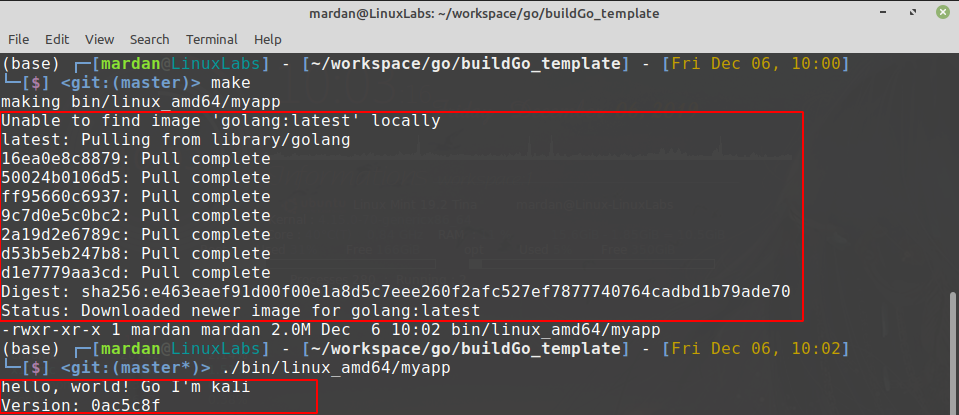

# buildGo template

+ **Running**
```
go mod vendor
make
```
you can check `./bin/<your OS _ computer cpu arch>/<you app name >`

## Go Modules

This assumes the use of go modules (which will be the default for all Go builds
as of Go 1.13) and vendoring (which reasonable minds might disagree about).
You will need to run `go mod vendor` to create a `vendor` directory when you
have dependencies.

## Building

Run `make` or `make build` to compile your app.  This will use a Docker image
to build your app, with the current directory volume-mounted into place.  This
will store incremental state for the fastest possible build.  Run `make
all-build` to build for all architectures.

Run `make all-container` to build containers for all architectures.


Run `make clean` to clean up.

